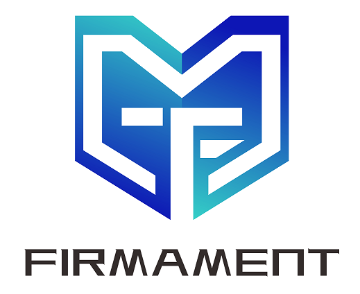
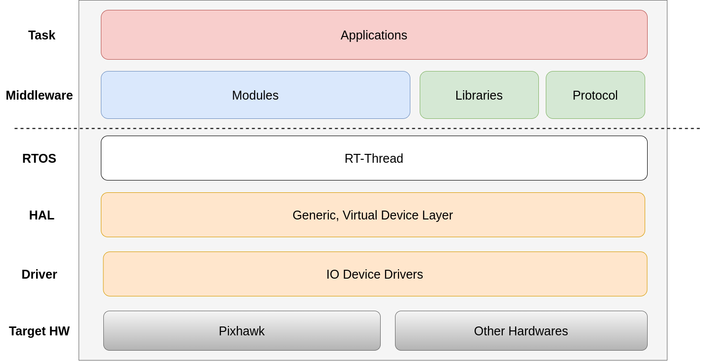

<p align="center"></p>

<p align="center">
  <a href="/LICENSE"></a>
  <a href="https://github.com/Firmament-Autopilot/FMT-Firmware/actions/workflows/build.yml"></a>
  <a href="https://github.com/Firmament-Autopilot/FMT-Firmware/releases"></a>
</p>

Overview
============================
Firmament (FMT) is an advanced autopilot system which is designed with Model-based design (MBD). It can be used to quickly and easily build the control system for autonomous vehicle, such as uav, car, ship, robot, etc.

The system is mainly composed of two parts.

- [FMT-Firmware](https://github.com/Firmament-Autopilot/FMT-Firmware): A stable and high performance embedded system designed with C/C++.
- [FMT-Model](https://github.com/Firmament-Autopilot/FMT-Model): A simulation framework with algorithm libraries designed with MATLAB/Simulink.

## Documentation
[User Guide](https://firmament-autopilot.github.io/FMT-DOCS/)

## Download

```
git clone https://github.com/Firmament-Autopilot/FMT-Firmware.git --recursive --shallow-submodules
```

> Note that FMT-Firmware contains submodules, use *--recursive* to download submodule as well.

## Feature

- High development efficency achieved with model-based deisign and debug easier.
- A stable and high performance embedded system designed with C/C++.
- A powerful simulation framework with various algorithm library designed with MATLAB/Simulink.
- Auto code generation from Simulink model adapted to different hardware platforms (ARM, AMD, Intel, etc).
- Excellent real-time performance based on [RT-Thread](https://www.rt-thread.io/) RTOS with active community and large number of third-party components.
- Support with most widely used open-source hardware Pixhawk (Both FMUv2 and FMUv5 are supported).
- Cross-platform toolchain support with Windows/Linux/Mac.
- Support with Mavlink and [QGroundcontrol](https://cn.bing.com/search?form=MOZLBR&pc=MOZI&q=QGroundControl).

## Architecture
FMT Firmware's architecture is shown in the figure below.



## Hardware
Current supported hardware:
- [AMOV ICF5](https://github.com/Firmament-Autopilot/FMT-Firmware/tree/master/target/amov/icf5)
- [CUAV V5+](https://github.com/Firmament-Autopilot/FMT-Firmware/tree/master/target/cuav/v5_plus)
- [Pixhawk4 (FMUv5)](https://github.com/Firmament-Autopilot/FMT-Firmware/tree/master/target/pixhawk/fmu-v5)
- [Pixhawk (FMUv2)](https://github.com/Firmament-Autopilot/FMT-Firmware/tree/master/target/pixhawk/fmu-v2)
- [HEX Cubeorange](https://github.com/Firmament-Autopilot/FMT-Firmware/tree/master/target/cubepilot/cubeorange)
- [QEMU vexpress-a9](https://github.com/Firmament-Autopilot/FMT-Firmware/tree/master/target/qemu/qemu-vexpress-a9)
  

The drone hardware equipped with FMT:
- [Amovlab MFP450](https://item.taobao.com/item.htm?spm=a1z10.5-c-s.w4002-22617251051.15.4b224df8j1oIGP&id=713417934359)

## License
[Apache-2.0](./LICENSE)
