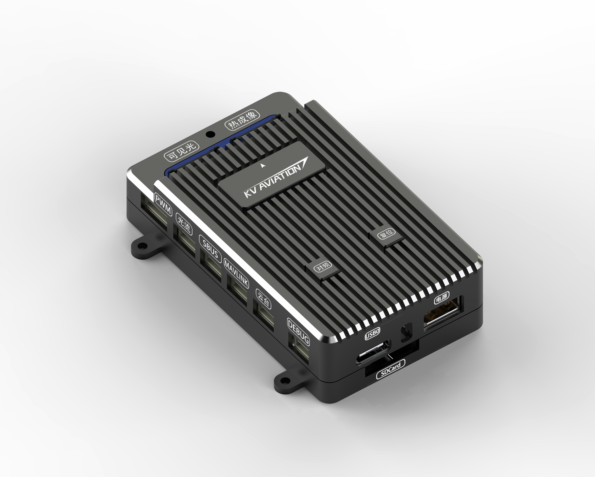
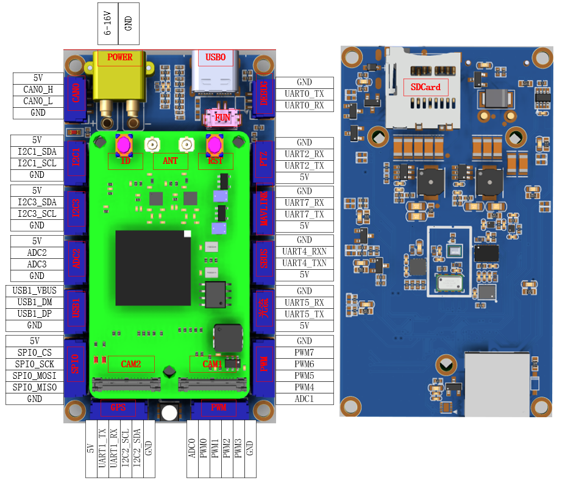

COOLFLY F2S Flight Controller
============================

F2S is a autopilot hardware created by COOLFLY teams. F2S is equipped with the latest FMT stable firmware and can be applied to various robotics application scenarios.



## Feature

- FMU Processor: 
  - 32 Bit Arm® Cortex®-M7, 250MHz, 1.125MB memory, 384KB RAM
- On-board sensors:
  - IMU: BMI088/BMI055/ICM-20600
  - Magnetometer: IST8310
  - Barometer: SPL06-001/MS5611
- Interfaces:
  - 8 PWM outputs
  - Dedicated R/C input for PPM and SBUS
  - 1 GPS interface
  - 5 general purpose serial ports
  - 3 I2C ports
  - 1 SPI buses
  - 1 CAN Buses
  - 1 Type-C USB
  - 1 SH1.25 USB
- Power System:
  - Power module output: 5.5~17V
- Weight and Dimensions:
  - Weight: 20g
  - Dimensions: 70x35x20mm
- Other Characteristics:
  - Operating temperature: -20 ~ 85°c



## Build

Build firmware for quadcopter

```
cd FMT-Firmware/taget/coolfly/chuanyun_f2s
./cf_make.sh
```

> -jN allows N jobs at once which makes your build process quicker.

For other vehicle, such as fixwing, using

```
scons -j4 --vehicle=Fixwing
```

## Maintainer
liu wei
wei.liu@cecooleye.cn
