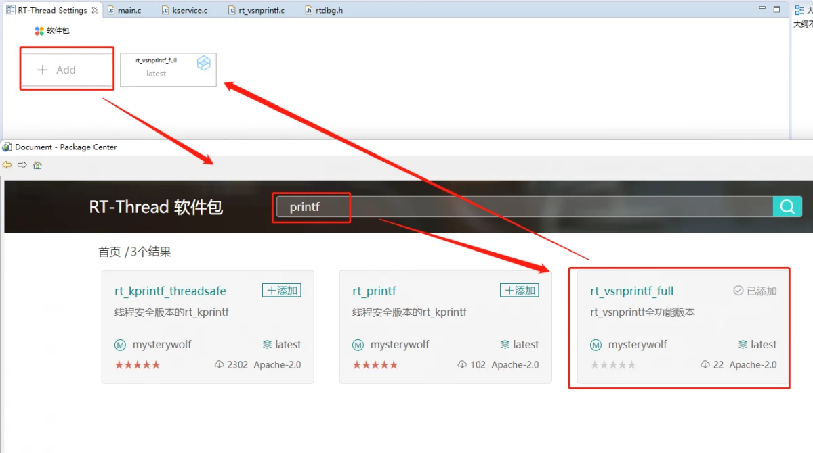
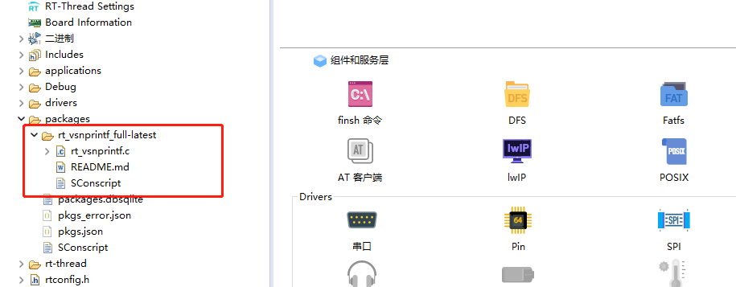
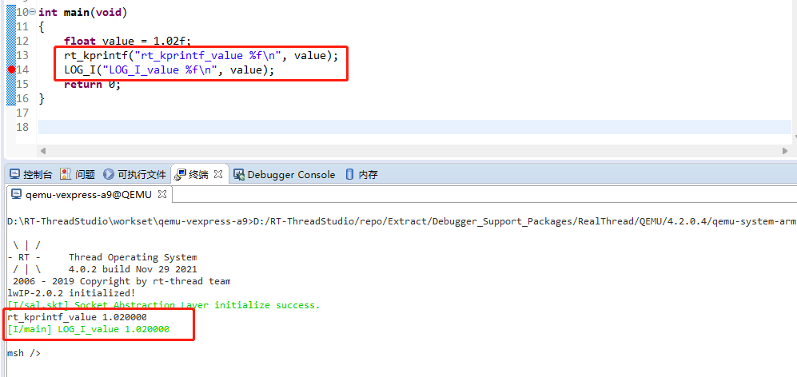

# rt_vsnprintf 完整功能版本

在RT-Thread的kservice.c源码中的这些函数的实现是为了满足RT-Thread内核的自持能力，即在不依赖标准C库的情况下，RT-Thread核心代码也可以正常运行，因此rt_kprintf、rt_sprintf、rt_snprintf、rt_vsnprintf这类打印函数（或者称之为rt_kprintf家族函数）仅仅满足内核的使用需求，不会实现完整的、和标准C库一致的功能，以减少ROM占用。但是，很多社区小伙伴希望rt_kprintf家族函数可以支持上更多的功能（例如打印浮点数据等等）。因此，本软件包实现了该功能。

本软件包实现了rt_kprintf家族函数的全功能版本，因为rt_kprintf家族函数的核心功能都是调用rt_vsnprintf函数，因此只需要重新实现rt_vsnprintf函数即可。本软件包基于开源项目[printf](https://github.com/eyalroz/printf)重新实现了rt_vsnprintf，在4.1.0以及以上的RT-Thread版本中，只需要安装本软件包即可。若RT-Thread低于4.1.0版本，需要手动将kservice.c内的rt_vsnprintf函数注释掉，再安装本软件包。

关于newlib下使用自带printf函数的问题可以参考这边帖子的评论区：https://club.rt-thread.org/ask/article/2b0a1d202135b205.html

## 接管标准C库的printf家族函数（仅支持4.1.0及以上版本）
本软件包有三个功能宏开关，是否允许本软件包接管printf、sprintf以及snprintf函数，默认为yes，即接管。
也就是说，安装本软件包后，即便没有使能libc(RT_USING_LIBC)，你可以正常的使用printf、sprintf以及snprintf函数，当你调用这三个函数时，会自动被rt_kprintf、rt_sprintf、rt_snprintf函数接管。你可以正常使用printf家族函数的所有功能。

```c
#include <stdio.h>

printf("hello world\n");
```

## ROM占用
GCC下占用8.6KB, Keil下占用8KB。远小于开启标准C库的ROM占用。

## 如何添加该软件包

```
RT-Thread online packages
    system packages --->
        enhanced kernel services --->
            [*] rt_vsnprintf_full: fully functional version of rt_vsnprintf --->
                    Version (latest)  --->
```

- 使用 `RT-Thread Studio` 打开 `RT-Thread Settings`, 点击添加软件包，输入关键字 `printf`, 添加 `rt_vsnprintf_full` 软件包，保存

  


- 软件包目录下多出了一个  `rt_vsnprintf_full-latest` 包

  


- 打开 rt_vsnprintf.c，发现其中也实现了 rt_vsnprintf

  ```c
  rt_int32_t rt_vsnprintf(char *buf, rt_size_t size, const char *fmt, va_list args)
  {
      return __vsnprintf(out_buffer, buf, size, fmt, args);
  }
  ```

- 注释掉 kservice.c 中的  rt_vsnprintf **(只针对4.1.0版本以下)**

- 重新编译并运行 `rt_kprintf ` 和 `LOG_I`, 浮点数打印正常
  


## 维护

[Meco Man](https://github.com/mysterywolf)

